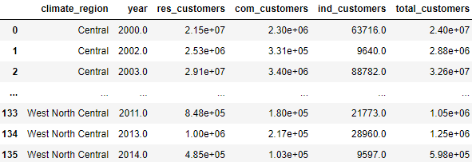
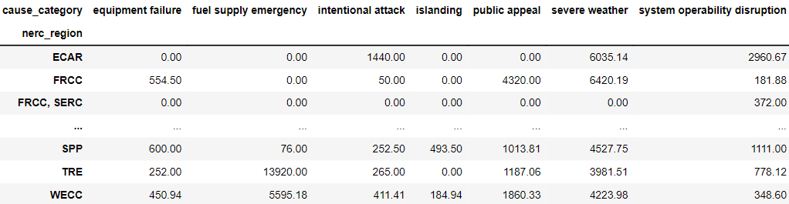
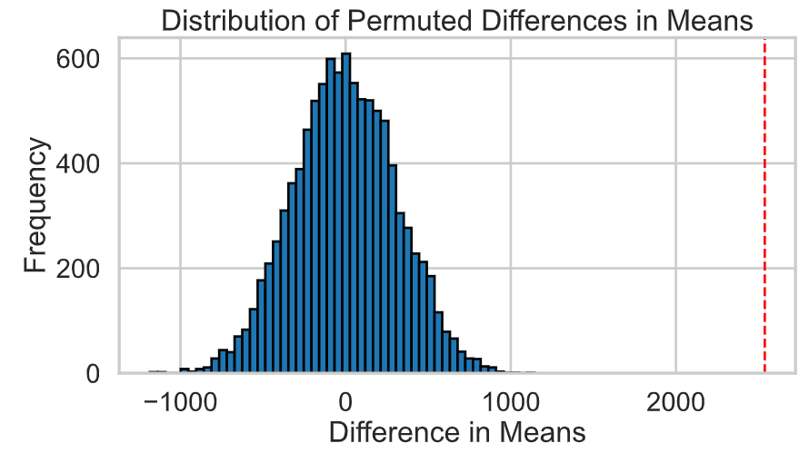

# US Power Outage Analysis
By Marija Vukic and Sadrac Santacruz Ibarra

# Introduction
Throughtout this project, we explore major power outage events in the US from January 2000 to July 2016, using a data set curated by [*Purdue University’s Laboratory for Advancing Sustainable Critical Infrastructure*](https://engineering.purdue.edu/LASCI/research-data/outages). The dataset tracks significant power outage events across the US in the span of 16 years, along with geographical, climatic, electricity consumption trends, and economic attributes of the states impacted by these outages. Throughout this project we clean our data, conduct exploratory analysis to grasp an understanding of the trends present in our data, perform hypothesis testing, and create a prediction model. 

The NERC (North American Electric Reliability Corporation) is an organization with various regions that works to reduce the risk to the security and reliability of the North American bulk power system. Each NERC region is managed under its own division and covers a specific portion of the US. Notably, some NERC regions span multiple climate zones, presenting unique challenges in managing power outage events effectively. Our project aims to explore the question, ***what are the most frequent causes of power outages resulting in longer durations on average compared to other causes for each NERC region of the United States?*** 

Our initial raw data frame consists of 1535 rows and 57 columns. Of these columns from our initial data frame, we kept 31 columns for the sake of our analysis as described below. 

|Column                |Description|
|---                |---        |
|`'year'`                |Year an outage occurred|
|`'month'`                |Month an outage occurred|
|`'us_state'`                |US state the outage occurred in|
|`'nerc_region'`                |Region defined by the North American Electric Reliability Corporation (NERC) in which the outage occured|
|`'climate_region'`                |One of 9 U.S. Climate regions as defined by National Centers for Environmental Information (NCEI)|
|`'outage_start_date'`                |Day of the year when the outage event started|
|`'outage_start_time'`                |Time of the day when the outage event started|
|`'outage_restoration_date'`                |Day of the year when power was restored to all the customers|
|`'outage_restoration_time'`                |Time of the day when power was restored to all the customers|
|`'cause_category'`                |One of 7 categories that decribe the causes for major power outages|
|`'cause_category_detail'`                |Detailed description of the event categories causing the major power outages|
|`'outage_duration'`                |Duration of outage events (minutes)|
|`'customers_affected'`                |Number of customers affected by the power outage event|
|`'res_price'`                |Monthly electricity price in the residential sector (cents/kilowatt-hour)|
|`'com_price'`                |Monthly electricity price in the commercial sector (cents/kilowatt-hour)|
|`'ind_price'`                |Monthly electricity price in the industrial sector (cents/kilowatt-hour)|
|`'total_price'`                |Average monthly electricity price in the U.S. state (cents/kilowatt-hour)|
|`'res_sales'`                |Electricity consumption in the residential sector (megawatt-hour)|
|`'com_sales'`                |Electricity consumption in the commercial sector (megawatt-hour)|
|`'ind_sales'`                |Electricity consumption in the industrial sector (megawatt-hour)|
|`'total_sales'`                |Total electricity consumption in the U.S. state (megawatt-hour)|
|`'res_customers'`                |Annual number of customers served in the residential electricity sector of the U.S. state|
|`'com_customers'`                |Annual number of customers served in the commercial electricity sector of the U.S. state|
|`'ind_customers'`                |Annual number of customers served in the industrial electricity sector of the U.S. state|
|`'total_customers'`                |Annual number of total customers served in the U.S. state|
|`'pc_realgsp_state'`                |Per capita real gross state product (GSP) in the U.S. state (measured in 2009 chained U.S. dollars)|
|`'pc_realgsp_usa'`                |	Per capita real GSP in the U.S. (measured in 2009 chained U.S. dollars)|
|`'pc_realgsp_rel'`                |Relative per capita real GSP as compared to the total per capita real GDP of the U.S. (expressed as fraction of per capita State real GDP & per capita US real GDP)|
|`'pc_realgsp_change'`                |Percentage change of per capita real GSP from the previous year (in %)|
|`'total_realgsp'`                |Real GSP contributed by all industries (total) (measured in 2009 chained U.S. dollars)|
|`'population'`                |Population in the U.S. state in a year|

# Data Cleaning & Exploratory Data Analysis

## Data Cleaning
In order to investigate our question, we begin by cleaning our data.

Here are the first five rows of our raw data frame:

1. After importing our data, we found there were multiple columns and rows we had to drop as a result of the way the data was originally formated. As a result we dropped the first row that contained metrics symbols and the `'variables'` column. 

2. Next, we droped 25 columns that were irrelevant to our goals of data analysis. From there, we had 31 remaining columns, which included `'YEAR'`, `'MONTH'`, `'U.S._STATE'`, `'NERC.REGION'`, `'CLIMATE.REGION'`, `'OUTAGE.START.DATE'`, `'OUTAGE.START.TIME'`, `'OUTAGE.RESTORATION.DATE'`, `'OUTAGE.RESTORATION.TIME'`, `'CAUSE.CATEGORY'`, `'CAUSE.CATEGORY.DETAIL'`, `'OUTAGE.DURATION'`, `'CUSTOMERS.AFFECTED'`, `'RES.PRICE'`, `'COM.PRICE'`, `'IND.PRICE'`, `'TOTAL.PRICE'`, `'RES.SALES'`, `'COM.SALES'`, `'IND.SALES'`, `'TOTAL.SALES'`, `'RES.CUSTOMERS'`, `'COM.CUSTOMERS'`, `'IND.CUSTOMERS'`, `'TOTAL.CUSTOMERS'`, `'PC.REALGSP.STATE'`, `'PC.REALGSP.USA'`, `'PC.REALGSP.REL'`, `'PC.REALGSP.CHANGE'`, `'TOTAL.REALGSP'`, and `'POPULATION'`.

3. We then reformatted our columns for ease of useability when calling them throughout. We lowered the case, then replaced any periods with underscores. An example of this reformatting is as follows: `'U.S._STATE'` &#8594; `'us_state'`.

4. From there, we created additional columns to further aid us in our analysis. 

First we concactenated the data for both outage start and restoration dates and times. The new columns we created are `'outage_start'`, which combines `'outage_start_date'` and `'outage_start_time'` into a single column, and `'outage_restoration'`, which combines `'outage_restoration_date'` and `'outage_restoration_time'` into a single column. Next, we also created columns that store data on the revenue by industry (residential, commercial, industrial, and total). We aggregated the data for these columns by taking each industry's specific price and sales data and multiplying them together to calculate revenue. We decided to create these revenue columns to explore their distributions throughout our EDA process.

|Column                |Description|
|---                |---        |
|`'outage_start'`                |Day of the year and time of day when the outage event started|
|`'outage_restoration'`                |Day of the year and time of day when power was restored to all the customers|
|`'res_revenue'`                |Average monthly electricity revenue in the residential sector (price in dollars per megawatt-hour)|
|`'com_revenue'`                |Average monthly electricity revenue in the commercial sector (price in dollars per megawatt-hour)|
|`'ind_revenue'`                |Average monthly electricity revenue in the industrial sector (price in dollars per megawatt-hour)|
|`'total_revenue'`                |Average monthly electricity revenue in the U.S. state (price in dollars per megawatt-hour)|

The first five rows of our cleaned data frame looks as such:

## Exploratory Data Analysis
Next, we want to grap a better understanding of our data throughout visualizations that give us insights into different data distributions and relationships between different variables in our data set.

### Univariate Analysis
1.First we analyze the distributions of power outages across both climate and NERC regions.
<iframe
  src="assets/number_of_power_outages_comparison.html"
  width="800"
  height="600"
  frameborder="0"
></iframe>
We observe that the climate region with the greatest amount of power outages from January 2000 to July 2016 is the Northeast. Additionally, we also observe the top two regions most impacted by power outages are the WECC and RFC regions.

2.Next I wanted to analyze the leading cause categories of power outages.
<iframe
  src="assets/cause_cat_dist.html"
  width="800"
  height="600"
  frameborder="0"
></iframe>
The leading cause category is severe weather, with almost 50% of reported outage events in the US falling into that category.

3.We also wanted to analyze the distribution of outage duration (min) across the 16 years the data has been recorded.
<iframe
  src="assets/outage_dist.html"
  width="800"
  height="600"
  frameborder="0"
></iframe>
Here we notice that the vast majority of outages lasted less than 20,000 minutes. It is also important to note that the distribution of outages is skewed to the right, indicating the presence of many outliers. These outliers represent outages that lasted significantly longer than the rest of the distribution, highlighting instances of severe disruptions.

### Bivariate Analysis
1.Here we compare the distribution of `'customers_affected'` to `'outage_duration'` using a scatterplot.  
<iframe
  src="assets/customer_outage.html"
  width="800"
  height="600"
  frameborder="0"
></iframe>
We observe that a shorter outage duration correlates to a smaller population of customers affected. Though there are outliers that demonstrate shorter outage events impacting upwards of 3 million customers.

2.Next we wanted to observe the outage duration amongst every climate and NERC region.
<iframe
  src="assets/outage_comparison.html"
  width="800"
  height="600"
  frameborder="0"
></iframe>
We observe that 

3.Additionally, we wanted to observe how outage events are distributed amongst cause categories for both `'climate_region'` and `'nerc_region'`.
<iframe
  src="assets/cause_comparison.html"
  width="800"
  height="600"
  frameborder="0"
></iframe>

### Interesting Aggregates
1.We wanted to analyze how total amount of customers across various regions has changed from January 2000 to July 2016. First, we groupby `'climate_region'` and `'year'` to isolate each instance of customer count per climate region across the past 16 years. The data for customers across all industries is tracked on an annual, state-by-state basis, so first we find the sum of all customers throughout a year period. We then took the mean to account for the average of customers per state by year. The result is a data frame that appears as follows:

From there, we plotted our aggregate for `'total_customers'` as follows.

<iframe
  src="assets/total_customers.html"
  width="800"
  height="600"
  frameborder="0"
></iframe>

We observe that the climate regions with the greatest customer growth across the US are the West and the Northeast, with many climate regions exhibiting a spike in customers around 2012.

2.Next, we created a pivot table to summarize the average outage duration for power outages across different cause categories and NERC regions in the United States. Each row represents a NERC region, each column represents a cause category, and the values show the average outage duration in minutes. This provides insights into outage duration variability across regions and the impact of different causes on outage duration.

<iframe
  src="assets/heatmap.html"
  width="800"
  height="600"
  frameborder="0"
></iframe>

3.Finally, we also wanted to aggregate the average amount of `'customers_affected'` annually from January 2000 to July 2016 per `'nerc_region'`.

<iframe
  src="assets/affected.html"
  width="800"
  height="600"
  frameborder="0"
></iframe>

# Assessment of Missingness
To assess for missingness dependency, we will be examining the `'customers_affected'` column of our data frame.

## NMAR Analysis
We suspect that the `'outage_start_time'` column in our dataset is likely NMAR (Not Missing At Random). This suspicion arises from the data collection process. According to the article *Data on Major Power Outage Events in the Continental U.S.*, the `'outage_start_time'` is "reported by the corresponding Utility in the region". This implies that the missing data could be due to the utility not knowing or failing to accurately record the exact start time of the outage. 

Additionally, when it comes to recording start time, factors that may cause missing data include:
1. A utility company focusing more on fixing the outage as opposed to tracking the events start.
2. Potential human error if a ultility company is not using adequate technology to track incidents.
3. Incident related reasoning: When an outage is caused by severe weather or complex technical failures, utility companies might have uncertain or hard-to-determine start times. Utilities might not have precise data on when the outage began, particularly in widespread or escalating events.

On the other hand, the `'outage_start_date'` is less likely to be NMAR because utilities have a broader time frame to report the date of an outage, making it more likely they can accurately record this information. Hence, we assume NMAR for `'outage_start_time'` due to its sensitivity and the potential for inaccuracies in recording the exact time.

To consider `'outage_start_time'` as MAR (Missing At Random), utility companies would need to provide a more detailed description of their data collection methods and the accuracy of their incident recording. Additionally, we can conduct an analysis to see if the missingness of `'outage_start_time'` is dependent on factors such as `'nerc_region'` or specific utilities in certain regions, which might indicate a pattern or dependency.

## Missingness Dependency
To assess for missingness dependency, we will be examining the `'customers_affected'` column of our data frame. We will test for dependecy using the `'us_state'` and `'nerc_region'` columns. We chose these columns as `'customers_affected'` might be dependent on columns related to geographical features. For example, certain each region or state may have varying data collection methods that could affect the availability of data relating to the `'customers_affected'` in an outage event. Therefore, we suspect that `'customers_affected'` is MAR (Missing At Random).

### US State
To start, we will be examining the `'us_state'` distribution.

**Null Hypothesis:** The distribution of `'us_state'` is the same when `'customers_affected'` is missing vs not missing.

**Alternate Hypothesis:** The distribution of `'us_state'` is different when `'customers_affected'` is missing vs not missing.

<iframe
  src="assets/missingness_state.html"
  width="800"
  height="600"
  frameborder="0"
></iframe>

We found an observed TVD of 0.0111 and a p value of 0.112. The empirical distribution of the TVDs is shown below. At alpha=0.05, we fail to reject the null hypothesis. The distribution of `'us_state'` is the same when 'customers_affected' is missing vs not missing, indicating that the missingness of `'customers_affected'` is not dependent on `'us_state'`.

<iframe
  src="assets/tvd_state.html"
  width="800"
  height="600"
  frameborder="0"
></iframe>

### NERC Region

Then we will examine the `'nerc_region'` distribution.

**Null Hypothesis:** The distribution of `'nerc_region'` is the same when `'customers_affected'` is missing vs not missing.

**Alternate Hypothesis:** The distribution of `'nerc_region'` is different when `'customers_affected'` is missing vs not missing.

<iframe
  src="assets/missingness_nerc.html"
  width="800"
  height="600"
  frameborder="0"
></iframe>

We found an observed TVD of 0.2738 and a p value of 0.0. The empirical distribution of the TVDs is shown below. At alpha=0.05, we fail to reject the null hypothesis. The distribution of `'nerc_region'` is different when `'customers_affected'` is missing vs not missing., indicating that the missingness of `'customers_affected'` is dependent on `'nerc_region'`.

<iframe
  src="assets/tvd_nerc.html"
  width="800"
  height="600"
  frameborder="0"
></iframe>

# Hypothesis Testing

**Null Hypothesis :** Severe-weather-induced power outages do not exhibit longer durations on average compared to power outages caused by other factors.

**Alternative Hypothesis :** Severe-weather-induced power outages exhibit longer durations on average compared to power outages caused by other factors.

**Test Statistic :** The test statistic we use is the *difference of means* between the average duration of power outage duration caused by severe weather and the average duration of power outage duration NOT caused by severe weather.

We conducted a permutation test with 10,000 simulations of our difference of means in order to generate an empirical distribution of the test statisic under the null hypothesis. 

We observed a significant difference in the average durations of power outages caused by severe weather compared to those caused by other factors. The observed difference in means between the two groups was approximately 2537.81 minutes. Given an alpha level of 0.05 and a p-value of 0.0, we reject the null hypothesis. This indicates that severe-weather-induced power outages exhibit longer durations on average compared to power outages caused by other factors.

The plot below shows the observed difference against the empirical distribution of differences from the permutation tests.

# Framing a Prediction Problem

# Baseline Model

# Final Model

# Fairness Analysis